# DO10 — Basic Kubernetes

## Part 1.

### 1. Запуск Kubernetes-окружения
Сделал: запустил локальный кластер Kubernetes с помощью Minikube.

---

### 2. Применение примерных манифестов
Сделал: применил манифесты из директории `/src/example` командой `kubectl apply`.

---

### 3. Запуск Kubernetes Dashboard
Сделал: запустил стандартную панель управления Kubernetes с помощью команды `minikube dashboard`.

---

### 4. Проброс портов к сервисам
Сделал: прокинул туннели для доступа к сервисам внутри кластера с помощью `kubectl service`.

---

### 5. Проверка работы приложения
Сделал: проверил доступность веб-приложения через браузер.

---

## Part 2.

### 1. Создание манифестов приложения
Сделал: написал собственные YAML-манифесты для приложения из первого проекта.

### 1.1 ConfigMap
Сделал: создал ConfigMap со значениями хостов и портов базы данных и сервисов.

---

### 1.2 Secret
Сделал: создал Secret с логином и паролем к базе данных и ключами межсервисной авторизации.

---

### 1.3 Deployment и Service
Сделал: создал Deployment и Service для postgres, rabbitmq и 7 сервисов приложения.
Для всех сервисов используется одна реплика.
Приложение запущено последовательным применением манифестов `kubectl apply -f`.

---

### 2. Проверка состояния объектов
Сделал: проверил состояние созданных ресурсов с помощью `kubectl get` и `kubectl describe`.

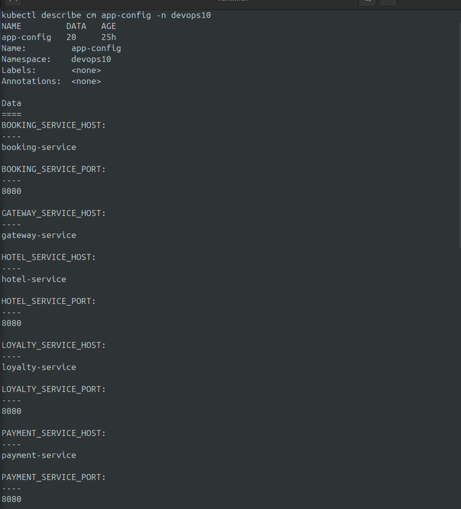
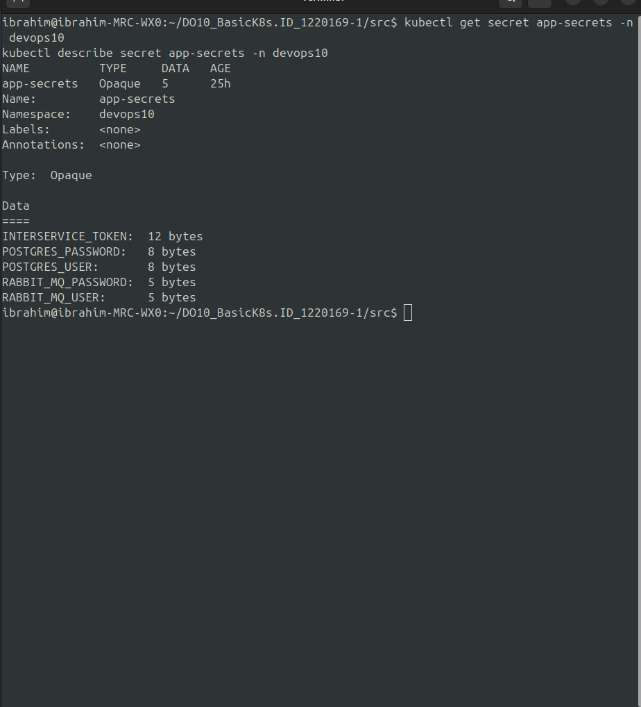
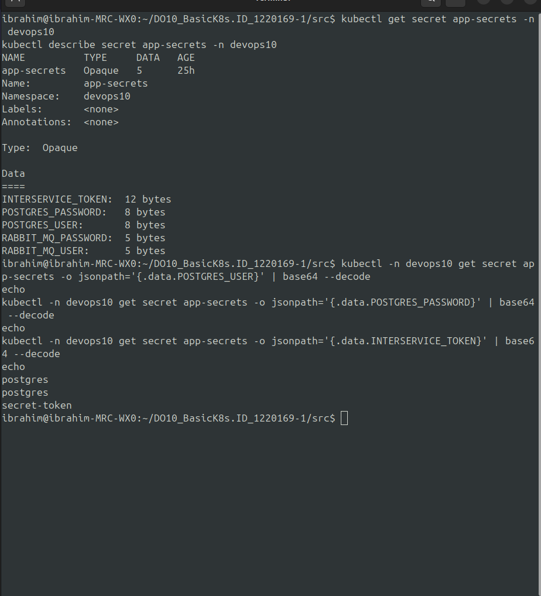

---

### 3. Проверка значений Secret
Сделал: проверил корректность значений секретов с декодированием из Base64.

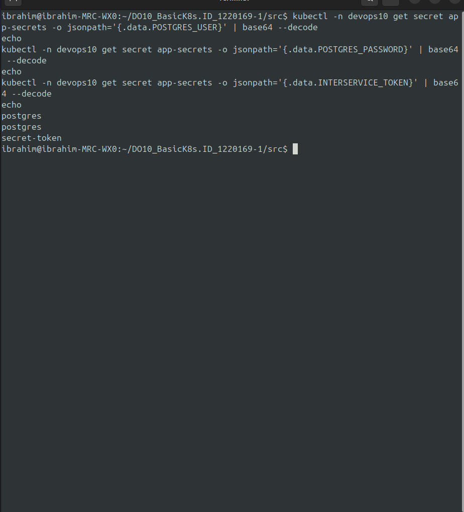

---

### 4. Проверка логов приложения
Сделал: проверил логи сервисов с помощью команды `kubectl logs`.

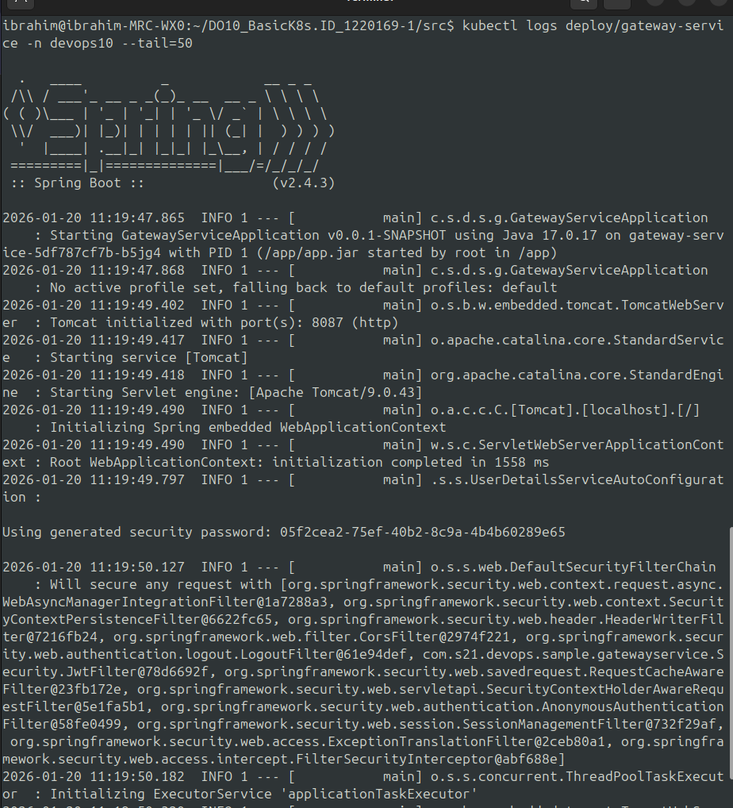

---

### 5. Проброс портов к gateway и session
Сделал: прокинул туннели для доступа к `gateway-service` и `session-service`.

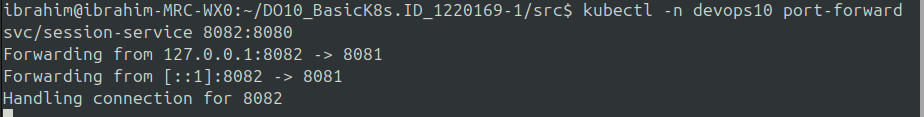
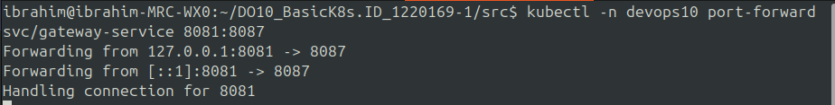

---

### 6. Функциональные тесты Postman
Сделал: запустил функциональные тесты Postman / Newman для проверки работы API.

---

### 7. Kubernetes Dashboard — мониторинг
Сделал: в Kubernetes Dashboard проверил состояние нод, список Pod, загрузку CPU и памяти,
конфигурации, секреты и логи Pod.

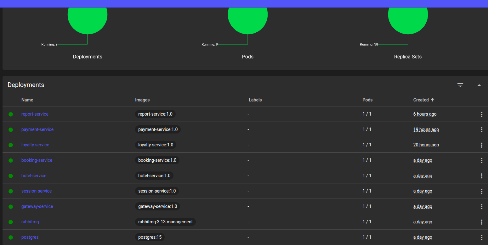
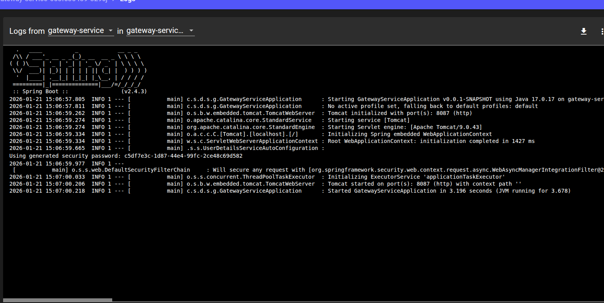
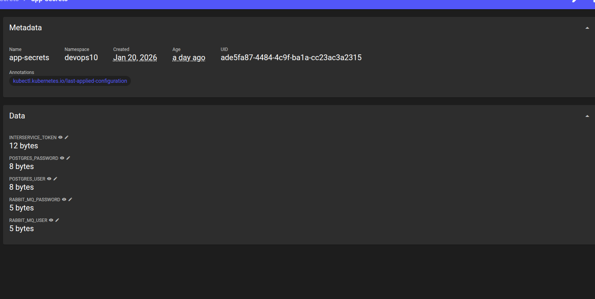
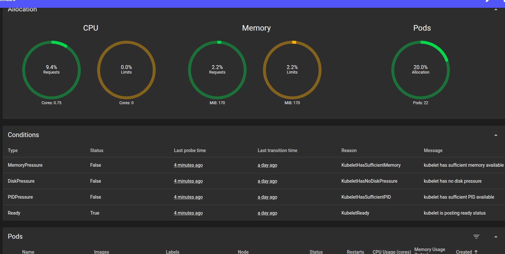

---

### 8. Обновление приложения и стратегии развертывания
Сделал: обновил приложение, добавив новую зависимость в `pom.xml`, и пересобрал образы.

#### Recreate
Развертывание с полной остановкой старых Pod.

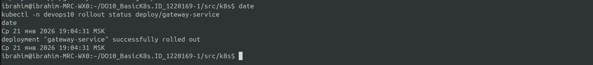

#### Rolling Update
Последовательное обновление Pod без остановки сервиса.

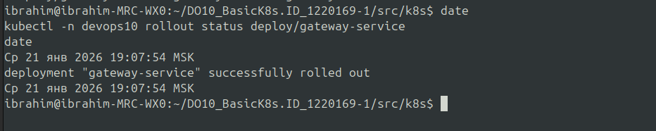
